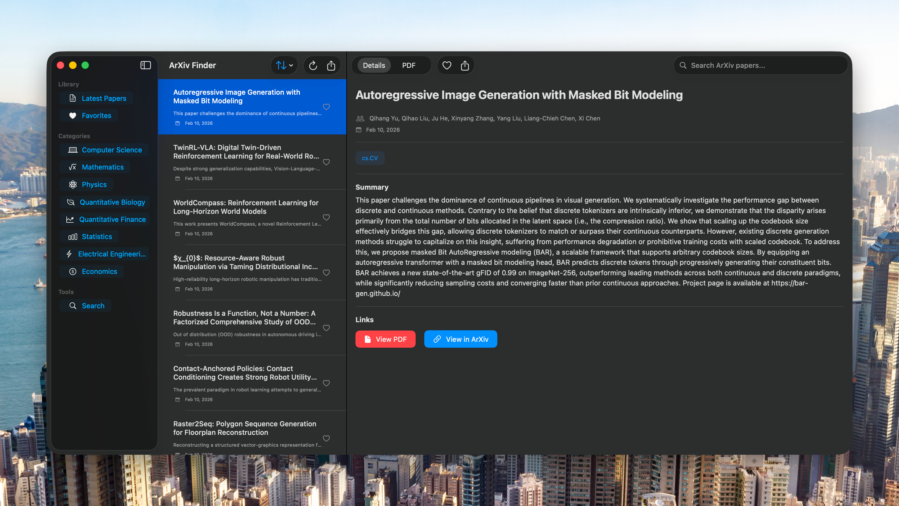
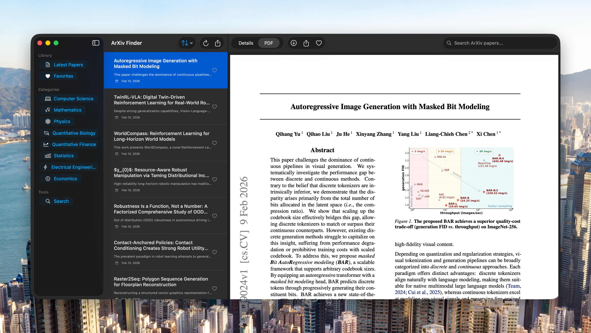

# ArXiv Finder

<p align="center">
  <strong>A native SwiftUI app for discovering, filtering, and reading research papers from arXiv.</strong>
</p>

<p align="center">
  
  
  
  
</p>

## Overview

ArXiv Finder is a multi-platform Apple app (macOS + iOS) that lets you:

- Browse recent papers by major arXiv domains
- Search papers by keywords with category filtering
- Sort results by date, title, or citation count
- Save favorites with persistent local storage
- Read paper details and PDFs inside the app
- Customize behavior and UI from a built-in Settings screen

The app is built with SwiftUI, uses SwiftData for persistence, and relies on [ArxivKit](https://github.com/ivicamil/ArxivKit) for arXiv API queries.

## Screenshots

### Main Workspace


### In-App PDF Reader


### Settings


## Key Features

- Category browser:
  - Latest
  - Computer Science
  - Mathematics
  - Physics
  - Quantitative Biology
  - Quantitative Finance
  - Statistics
  - Electrical Engineering
  - Economics
- Powerful search:
  - Query-based search with category filter
  - Search history shortcuts
- Sorting controls:
  - Date
  - Title
  - Citations
- Reading workflow:
  - Rich detail pane (authors, dates, summary, categories, links)
  - Built-in PDF rendering via PDFKit
  - Download/share actions for PDFs
- Favorites:
  - One-click favorite toggle from lists and detail view
  - Persistent favorite state through SwiftData
- Configurable app behavior:
  - Max papers per load
  - Default category
  - Auto-refresh + refresh interval
  - Accent color, compact mode, preview visibility, font size
  - PDF cache toggles and cache clearing

## Requirements

- macOS 15.5 or later (for the macOS app)
- Xcode with modern SwiftUI/SwiftData support (for building from source)
- Internet connection to fetch papers from arXiv

## Install and Run

### Option 1: Install from DMG (Recommended for users)

1. Download the latest `ArXiv-Finder-<version>-macOS.dmg`.
2. Open the DMG.
3. Drag `ArXiv Finder.app` into `Applications`.
4. Launch from `Applications`.

If macOS blocks first launch, right-click the app, choose `Open`, then confirm.

### Option 2: Build and run from source

```bash
git clone https://github.com/linroger/ArXiv-Finder.git
cd ArXiv-Finder
open "ArXiv Finder.xcodeproj"
```

Then select the `ArXiv Finder` scheme and run in Xcode.

CLI build (macOS target):

```bash
xcodebuild \
  -project "ArXiv Finder.xcodeproj" \
  -scheme "ArXiv Finder" \
  -destination "platform=macOS" \
  build
```

## Create a DMG Installer

This repository includes a packaging script:

```bash
./scripts/build-dmg.sh
```

Output:

- DMG file: `dist/ArXiv-Finder-<marketing-version>-macOS.dmg`
- Release app bundle (derived data): `.build-macos/Build/Products/Release/ArXiv Finder.app`

## How to Use the App

1. Launch `ArXiv Finder`.
2. Pick a category from the sidebar (macOS) or category menu (iOS).
3. Use the sort menu to reorder by date, title, or citation count.
4. Open a paper to view details and switch between `Details` and `PDF`.
5. Click/tap the heart icon to add/remove favorites.
6. Use the Search screen to run keyword searches and filter by category.
7. Open Settings to configure refresh behavior, UI preferences, and cache options.

## Architecture Summary

```text
ArXiv Finder/
├── Models/
│   └── ArXivPaper.swift
├── Services/
│   └── ArXivService.swift
├── Controllers/
│   └── ArXivController.swift
├── Views/
│   ├── MainView.swift
│   ├── SidebarView.swift
│   ├── PapersListView.swift
│   ├── SearchResultsView.swift
│   ├── PaperDetailView.swift
│   ├── ArXivPaperRow.swift
│   ├── PDFKitView.swift
│   └── SettingsView.swift
└── Managers/
    └── CacheManager.swift
```

## Notes and Current Behavior

- Citation counts are currently mock values (arXiv feed does not provide citation counts directly).
- PDF caching is supported via `CacheManager`; users can clear cache in Settings.
- Search uses ArxivKit-backed queries and includes category-aware filtering.

## Testing and Smoke Checks

```bash
# Lightweight project smoke check
./init.sh

# Build
xcodebuild -project "ArXiv Finder.xcodeproj" -scheme "ArXiv Finder" -destination "platform=macOS" build
```

Note: the currently shared Xcode scheme is not configured with an active `test` action, so `xcodebuild ... test` will return a scheme configuration error until test execution is enabled in the scheme.

## License

No license file is currently included in this repository.
