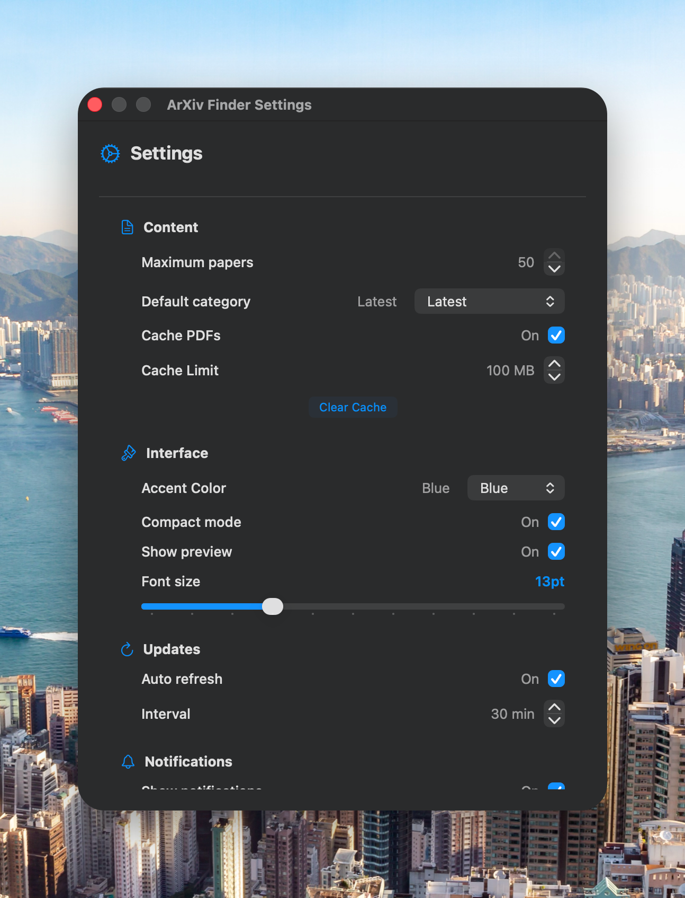

# ArXiv Finder

**ArXiv Finder** is a powerful, native macOS and iOS application designed for researchers, students, and enthusiasts to easily browse, search, and manage scientific papers from [ArXiv.org](https://arxiv.org).

Built with SwiftUI and SwiftData, ArXiv Finder offers a modern, seamless experience across Apple platforms, featuring robust offline capabilities and intuitive paper management.

## Key Features

- **Multi-Category Browsing**: Access papers across major disciplines including Computer Science, Mathematics, Physics, Quantitative Biology, Quantitative Finance, Statistics, Electrical Engineering, and Economics.
- **Advanced Search**: Perform basic or enhanced searches to find specific papers or topics.
- **Smart Sorting**: Sort papers by Date, Title, or Citation count to find the most relevant research.
- **Favorites & Persistence**: Save your favorite papers for quick access. Data is persisted locally using SwiftData.
- **PDF Integration**: View papers directly within the app with a built-in PDF viewer.
- **Cross-Platform**: Optimized for both macOS and iOS/iPadOS with adaptive UI.
- **Customizable**: Adjust settings for paper limits, refresh intervals, and app themes.

## Screenshots

<p align="center">
  
  
  
</p>

## Installation

### Prerequisites
- macOS 14.0+ or iOS 17.0+
- Xcode 15.0+

### Building from Source

1. **Clone the repository:**
   ```bash
   git clone https://github.com/yourusername/ArXiv-Finder.git
   cd ArXiv-Finder
   ```

2. **Open the project in Xcode:**
   ```bash
   open "ArXiv Finder.xcodeproj"
   ```

3. **Build and Run:**
   - Select your target device (My Mac or an iOS Simulator).
   - Press `Cmd + R` to build and run the application.

### Creating an Installer (macOS)

To distribute the app as a `.dmg` installer:

1. Build the app for Release in Xcode (`Product > Archive` -> `Distribute App` -> `Copy App`).
2. Place the `ArXiv Finder.app` in the project root or build directory.
3. Run the packaging script:
   ```bash
   ./scripts/create_dmg.sh
   ```
   This will generate `ArXiv_Finder_Installer.dmg`.

## Usage

1. **Browse**: Use the sidebar (macOS) or tab bar (iOS) to navigate between different categories.
2. **Search**: Enter keywords in the search bar to find papers.
3. **Read**: Click on a paper to view its details and abstract. Tapping the PDF icon opens the full paper.
4. **Favorite**: Tap the star icon to save a paper to your Favorites list.
5. **Settings**: Customize the app appearance and behavior in the Settings menu.

## License

This project is licensed under the MIT License - see the LICENSE file for details.
